# Projet Rpy

## Python importation


```python
#!/usr/bin/env python3
# -*- coding: ISO-8859-1 -*-
import os
import pandas as pd
import matplotlib.pyplot as plt
import numpy as np
import seaborn as sns
import statistics
	
from sklearn.utils import resample
```

## Rpy2 importation


```python
from rpy2 import robjects
import rpy2.robjects as ro
import rpy2.robjects.packages as rpackages
from rpy2.robjects import Formula, Environment
from rpy2.robjects.vectors import IntVector, FloatVector, StrVector
from rpy2.robjects.lib import grid
from rpy2.robjects.packages import importr, data
from rpy2.rinterface_lib.embedded import RRuntimeError
from functools import partial
from rpy2.ipython import html
from rpy2.robjects import pandas2ri

from rpy2.robjects.conversion import localconverter
import warnings

# R package names
packnames = ('ggplot2', 'stats','grDevices','readr','knitr','ggpllot2','dplyr','tidyr','questionr')

utils = importr('utils')
# Selectively install what needs to be install.
# We are fancy, just because we can.
names_to_install = [x for x in packnames if not rpackages.isinstalled(x)]
if len(names_to_install) > 0:
    utils.install_packages(StrVector(names_to_install))

# Recoding R function which make them available in Python

rprint = robjects.globalenv.find("print")
stats = importr('stats')
grdevices = importr('grDevices')
base = importr('base')
summarytools = importr('summarytools')
readr = importr('readr')
knitr = importr('knitr')
ggplot2 = importr('ggplot2')
dplyr = importr('dplyr')
tidyr = importr('tidyr')
questionr = importr('questionr')
nortest = importr('nortest')

# For notebook
html.html_rdataframe=partial(html.html_rdataframe, table_class="docutils")

```

    R[write to console]: Installation du package dans ‘/home/jofriii/R/x86_64-pc-linux-gnu-library/3.6’
    (car ‘lib’ n'est pas spécifié)
    


## Dataset loading


```python
pd.set_option('display.max_columns', None)
path = "/home/jofriii/Documents/M1_DSS/Rpy/Rea/export_data.csv"
data = pd.read_csv(path, delimiter=";", encoding="iso-8859-1", low_memory=False, decimal=',')
```

## Exploratory analysis

### Selecting data of interrest and visualisation


```python
stat_descriptives = data.iloc[:,0:16]
stat_descriptives['DUREE_SEJOUR'] = data['DUREE_SEJOUR_INTERV'].values
stat_descriptives = stat_descriptives.drop(['ID_INTERVENTION',
                                              'ID_PATIENT',
                                              'POIDS_IDEAL_LORENTZ',
                                              'POIDS_IDEAL',
                                              'DELTA_POIDS_POIDS_IDEAL',
                                             'URGENCE',
                                           "CATEGORIE_AGE_ADULTE"], axis = 1)
stat_descriptives = stat_descriptives[stat_descriptives.SEXE != "I"]
stat_descriptives = stat_descriptives[stat_descriptives.AGE >18]
stat_descriptives = stat_descriptives[stat_descriptives.POIDS < 400]
cut_label = ['moins de 18 ans','18-24','25-29','30-34','35-39','40-44','45-49','50-54','55-59','60-64','65-69','70-74','plus de 75 ans']
cut_bins = [18,20,25,30,35,40,45,50,55,60,65,70,75,150]
stat_descriptives['CATEGORIE_AGE'] = pd.cut(stat_descriptives.AGE, bins=cut_bins, labels=cut_label, right = False)


var=['AGE','POIDS','TAILLE','IMC','DUREE_SEJOUR']
for v in stat_descriptives[var]:
    sns.set()
    chart = sns.distplot(stat_descriptives[v])
    chart = plt.xlabel(v)
    chart = plt.ylabel('Pourcentage')
    chart = plt.title("Répartition au sein de l'échantillon")
    plt.show()
    
    sns.set()
    chart = sns.boxplot(x=stat_descriptives.CATEGORIE_AGE, y=stat_descriptives[v])
    chart = plt.xlabel('AGE')
    chart = plt.ylabel(v)
    chart = plt.title("Boxplot en fonction de la classe d'âge")
    plt.xticks(
        rotation=45, 
        horizontalalignment='right',
        fontweight='light')
    plt.show()
        

```


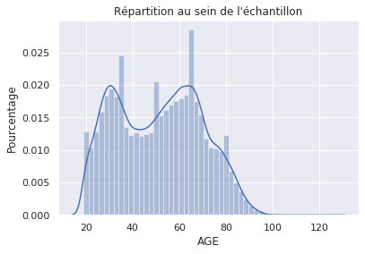


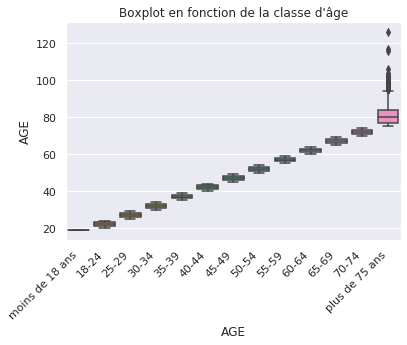


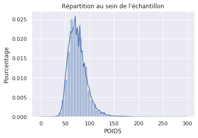


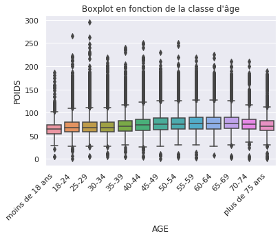


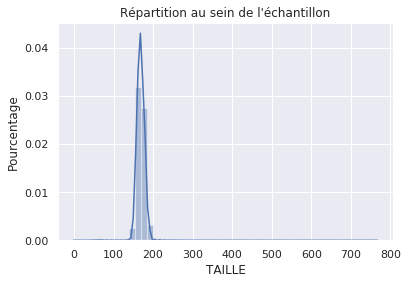


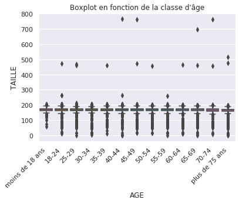


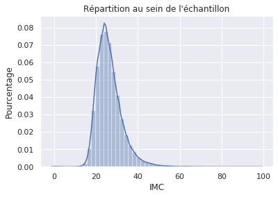


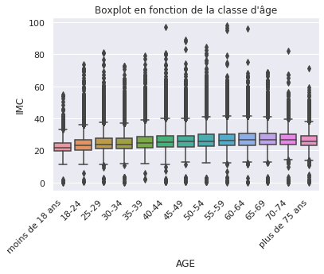


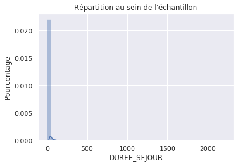


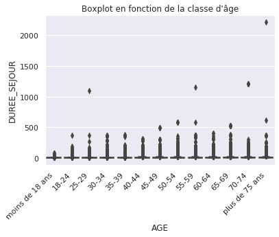


```python
### Détection des valeurs aberrantes
```

## Outliers management


```python
##robjects.r("outlier_values <- boxplot.stats(inputData$pressure_height)$out")
pandas2ri.activate()
var=['AGE','POIDS','TAILLE','IMC','DUREE_SEJOUR']
for i in stat_descriptives[var]:
    with localconverter(ro.default_converter + pandas2ri.converter):
        df_summary = grdevices.boxplot_stats(stat_descriptives[i])
        
    with localconverter(ro.default_converter + pandas2ri.converter):
        pd_from_r_df = np.asarray(ro.conversion.rpy2py(df_summary))
        print(i,pd_from_r_df[0])
pandas2ri.deactivate()
```

    AGE [ 19.  35.  52.  66. 106.]
    POIDS [ 28.  62.  73.  85. 119.]
    TAILLE [143. 162. 168. 175. 194.]
    IMC [11.7 22.2 25.3 29.3 39.9]
    DUREE_SEJOUR [ 0.  1.  3.  7. 16.]


```python
data_poids = stat_descriptives['POIDS'] < 119
data_poids2 = stat_descriptives['POIDS'] > 28
data_age = stat_descriptives['AGE'] < 106
data_age2 = stat_descriptives['AGE'] > 19
data_taille = stat_descriptives['TAILLE'] < 194
data_taille2 = stat_descriptives['TAILLE'] > 143
data_imc = stat_descriptives['IMC'] < 40
data_imc2 = stat_descriptives['IMC'] > 11.7
data_sejour = stat_descriptives['DUREE_SEJOUR'] < 16
data_select = stat_descriptives[data_age & data_taille2 & data_taille & data_poids & data_age2 & data_poids2 & data_imc & data_imc2 & data_sejour]

```


```python
var=['AGE','POIDS','TAILLE','IMC','DUREE_SEJOUR']
for v in data_select[var]:
    sns.set()
    chart = sns.distplot(data_select[v])
    chart = plt.xlabel(v)
    chart = plt.ylabel('Pourcentage')
    chart = plt.title("Répartition au sein de l'échantillon")
    plt.show()
    
    sns.set()
    chart = sns.boxplot(y=data_select[v])
    chart = plt.ylabel(v)
    chart = plt.title(v)
    plt.show()
```


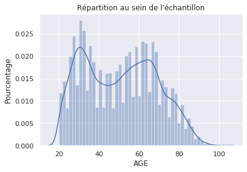


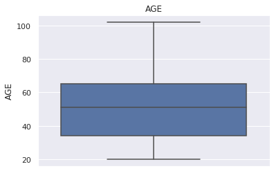


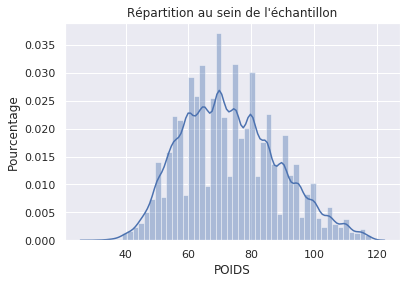


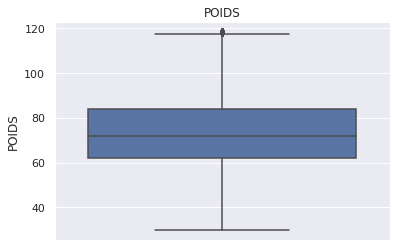


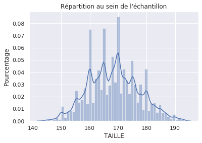


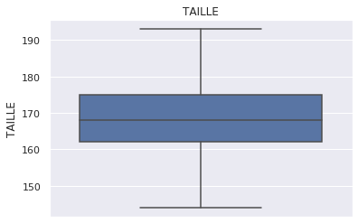


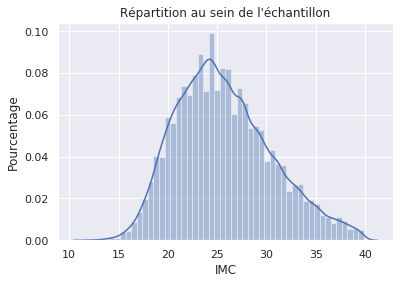


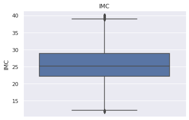


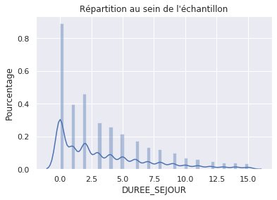


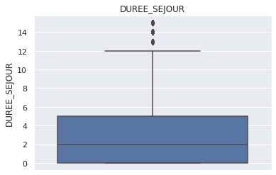


## Statistical analysis

### Quantitative variables


```python
var=['AGE','POIDS','TAILLE','IMC', 'DUREE_SEJOUR']
for v in [var] :
    stat_descriptives_r = data_select.loc[:,v]
    
    pandas2ri.activate()
    with localconverter(ro.default_converter + pandas2ri.converter):
      df_summary = base.summary(stat_descriptives_r)    
    print(v,df_summary)

    
print(statistics.stdev(data_select.AGE))
print(statistics.stdev(data_select.POIDS))
print(statistics.stdev(data_select.TAILLE))
print(statistics.stdev(data_select.IMC))
```

    ['AGE', 'POIDS', 'TAILLE', 'IMC', 'DUREE_SEJOUR'] ['Min.   : 20.00  ' '1st Qu.: 34.00  ' 'Median : 51.00  '
     'Mean   : 50.55  ' '3rd Qu.: 65.00  ' 'Max.   :102.00  '
     'Min.   : 30.00  ' '1st Qu.: 62.00  ' 'Median : 72.00  '
     'Mean   : 73.23  ' '3rd Qu.: 84.00  ' 'Max.   :118.00  '
     'Min.   :144.0  ' '1st Qu.:162.0  ' 'Median :168.0  ' 'Mean   :168.4  '
     '3rd Qu.:175.0  ' 'Max.   :193.0  ' 'Min.   :11.80  ' '1st Qu.:22.20  '
     'Median :25.20  ' 'Mean   :25.72  ' '3rd Qu.:28.90  ' 'Max.   :39.90  '
     'Min.   : 0.000  ' '1st Qu.: 0.000  ' 'Median : 2.000  '
     'Mean   : 3.512  ' '3rd Qu.: 5.000  ' 'Max.   :15.000  ']
    18.05010695315805
    15.399023382737152
    8.79829412429638
    4.859871218137372


```python
sns.set()
chart = sns.boxplot(x=data_select.SERVICE, y=data_select['DUREE_SEJOUR'])
chart = plt.xlabel('AGE')
chart = plt.ylabel(v)
chart = plt.title("Boxplot en fonction de la classe d'âge")
plt.xticks(
    rotation=45, 
    horizontalalignment='right',
    fontweight='light')
plt.show()
```


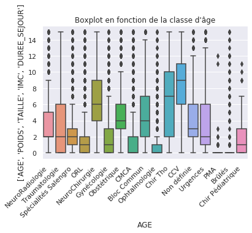


### Qualitative variables


```python
vqList=['CATEGORIE_AGE','CATEGORIE_IMC_ADULTE','ASA', 'CATEGORIE_ASA','SEXE']
for vq in data_select[vqList]:
    sns.countplot(data_select[vq])
    plt.xticks(
        rotation=45, 
        horizontalalignment='right',
        fontweight='light')
    plt.show()
```


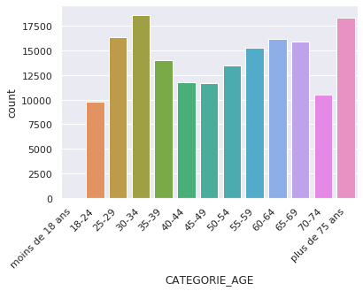


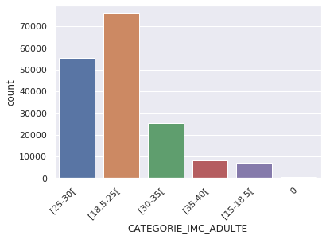


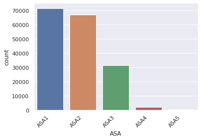


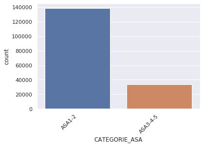


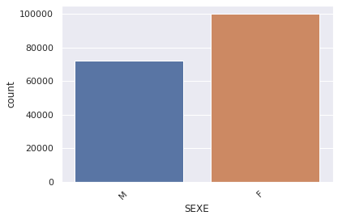


```python
vqList=['CATEGORIE_AGE','CATEGORIE_IMC_ADULTE','ASA', 'CATEGORIE_ASA','SEXE']
data_qual = data_select.loc[:,vqList]
data_qual.info()

data_qual.ASA = data_qual.ASA.astype('category')
data_qual.CATEGORIE_ASA = data_qual.CATEGORIE_ASA.astype('category')
data_qual.SEXE = data_qual.SEXE.astype('category')
data_qual.CATEGORIE_AGE = data_qual.CATEGORIE_AGE.astype('category')
data_qual.CATEGORIE_IMC_ADULTE = data_qual.CATEGORIE_IMC_ADULTE.astype('category')

for vq in data_select[vqList]:
    data_sel=data_qual[vq]
    pandas2ri.activate()
    with localconverter(ro.default_converter + pandas2ri.converter):
      df_summary = questionr.freq(data_sel)
    print('\n',vq,'\n',df_summary)
    pandas2ri.deactivate()
    
```

    <class 'pandas.core.frame.DataFrame'>
    Int64Index: 171958 entries, 0 to 299465
    Data columns (total 5 columns):
     #   Column                Non-Null Count   Dtype   
    ---  ------                --------------   -----   
     0   CATEGORIE_AGE         171958 non-null  category
     1   CATEGORIE_IMC_ADULTE  171958 non-null  object  
     2   ASA                   171887 non-null  object  
     3   CATEGORIE_ASA         171887 non-null  object  
     4   SEXE                  171958 non-null  object  
    dtypes: category(1), object(4)
    memory usage: 11.7+ MB
    
     CATEGORIE_AGE 
                            n     %  val%
    moins de 18 ans      0.0   0.0   0.0
    18-24             9769.0   5.7   5.7
    25-29            16381.0   9.5   9.5
    30-34            18640.0  10.8  10.8
    35-39            14035.0   8.2   8.2
    40-44            11726.0   6.8   6.8
    45-49            11714.0   6.8   6.8
    50-54            13499.0   7.9   7.9
    55-59            15288.0   8.9   8.9
    60-64            16197.0   9.4   9.4
    65-69            15876.0   9.2   9.2
    70-74            10475.0   6.1   6.1
    plus de 75 ans   18358.0  10.7  10.7
    
     CATEGORIE_IMC_ADULTE 
                      n     %  val%
    0            316.0   0.2   0.2
    [15-18.5[   7079.0   4.1   4.1
    [18.5-25[  75718.0  44.0  44.0
    [25-30[    55250.0  32.1  32.1
    [30-35[    25486.0  14.8  14.8
    [35-40[     8109.0   4.7   4.7
    
     ASA 
                 n     %  val%
    ASA1  71463.0  41.6  41.6
    ASA2  66894.0  38.9  38.9
    ASA3  31464.0  18.3  18.3
    ASA4   1943.0   1.1   1.1
    ASA5    123.0   0.1   0.1
    NA       71.0   0.0   NaN
    
     CATEGORIE_ASA 
                      n     %  val%
    ASA1-2    138357.0  80.5  80.5
    ASA3-4-5   33530.0  19.5  19.5
    NA            71.0   0.0   NaN
    
     SEXE 
              n     %  val%
    F  99794.0  58.0  58.0
    M  72164.0  42.0  42.0


## Inferential analysis

### ANOVA

#### Subset principal set into two group : ASA-low and ASA-high


```python
data_ASAinf = data_select.loc[data_select['CATEGORIE_ASA'] == 'ASA1-2']
print(data_ASAinf.shape) # Vérification du nombre correct de ligne
print(data_ASAinf.columns)

data_ASAsup = data_select.loc[data_select['CATEGORIE_ASA'] == 'ASA3-4-5']
print(data_ASAsup.shape) # Vérification du nombre correct de ligne
print(data_ASAsup.columns)
```

    (138357, 11)
    Index(['AGE', 'POIDS', 'TAILLE', 'IMC', 'CATEGORIE_IMC_ADULTE', 'ASA',
           'CATEGORIE_ASA', 'SEXE', 'SERVICE', 'DUREE_SEJOUR', 'CATEGORIE_AGE'],
          dtype='object')
    (33530, 11)
    Index(['AGE', 'POIDS', 'TAILLE', 'IMC', 'CATEGORIE_IMC_ADULTE', 'ASA',
           'CATEGORIE_ASA', 'SEXE', 'SERVICE', 'DUREE_SEJOUR', 'CATEGORIE_AGE'],
          dtype='object')


#### Unbalanced datasets, downgradation of the highest one


```python
data_ASAsup = resample(data_ASAsup,
                       replace=False,
                       n_samples=33530,
                       random_state=123) 
print(data_ASAsup.shape)
```

    (33530, 11)


#### Normality test on explained variable


```python
with localconverter(ro.default_converter + pandas2ri.converter):
    modele = nortest.lillie_test(data_ASAinf["DUREE_SEJOUR"])
with localconverter(ro.default_converter + pandas2ri.converter):
    pd_from_r_df = np.asarray(ro.conversion.rpy2py(modele))
    print("\n Normality test on sample with ASA 1 and 2 \n")
    print('D=',pd_from_r_df[0])
    print('p_value =', pd_from_r_df[1], '* \n * : < 2.2E-16')
```

    
     Normality test on sample with ASA 1 and 2 
    
    D= [0.17669447]
    p_value = [0.] * 
     * : < 2.2E-16


```python
pandas2ri.deactivate()

with localconverter(ro.default_converter + pandas2ri.converter):
    modele = nortest.lillie_test(data_ASAsup["DUREE_SEJOUR"])
with localconverter(ro.default_converter + pandas2ri.converter):
    pd_from_r_df = np.asarray(ro.conversion.rpy2py(modele))
    print("\n Normality test on sample with ASA 3, 4 and 5 \n")
    print('D=',pd_from_r_df[0])
    print('p_value =', pd_from_r_df[1], '* \n * : < à 2.2E-16')
pandas2ri.deactivate()

print("\n\n Samples are not normality distributed \n")
```

    
     Normality test on sample with ASA 3, 4 and 5 
    
    D= [0.18713604]
    p_value = [0.] * 
     * : < à 2.2E-16
    
    
     Samples are not normality distributed 
    


###### Wilcoxon test on mean comparison between sex no matter ASA groups


```python
data_M = data_select.loc[data_select['SEXE'] == 'M']
print(data_M.shape) # Vérification du nombre correct de ligne
print(data_M.columns)

data_F = data_select.loc[data_select['SEXE'] == 'F']
print(data_F.shape) # Vérification du nombre correct de ligne
print(data_F.columns)

with localconverter(ro.default_converter + pandas2ri.converter):
    modele = stats.wilcox_test(data_M["DUREE_SEJOUR"],data_F["DUREE_SEJOUR"])
with localconverter(ro.default_converter + pandas2ri.converter):
    pd_from_r_df = np.asarray(ro.conversion.rpy2py(modele))
    print('D=',pd_from_r_df[0])
    print('p_value =', pd_from_r_df[2], '* \n * : < à 2.2E-16')
pandas2ri.deactivate()

print(data_M.DUREE_SEJOUR.mean())
print(data_F.DUREE_SEJOUR.mean())
```

    (72164, 11)
    Index(['AGE', 'POIDS', 'TAILLE', 'IMC', 'CATEGORIE_IMC_ADULTE', 'ASA',
           'CATEGORIE_ASA', 'SEXE', 'SERVICE', 'DUREE_SEJOUR', 'CATEGORIE_AGE'],
          dtype='object')
    (99794, 11)
    Index(['AGE', 'POIDS', 'TAILLE', 'IMC', 'CATEGORIE_IMC_ADULTE', 'ASA',
           'CATEGORIE_ASA', 'SEXE', 'SERVICE', 'DUREE_SEJOUR', 'CATEGORIE_AGE'],
          dtype='object')
    D= [3.72911606e+09]
    p_value = [1.72238699e-37] * 
     * : < à 2.2E-16
    3.801590820907932
    3.3032647253341882


##### Khi-2 test on ASA 3-4-5 category


```python
var_anova_1=['SEXE','CATEGORIE_IMC_ADULTE', 'CATEGORIE_AGE', ]
for i in var_anova_1:
    sns.boxplot(y=data_ASAsup.DUREE_SEJOUR, x=data_ASAsup[i])
    plt.show()
```


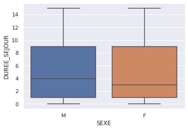


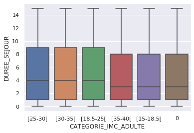


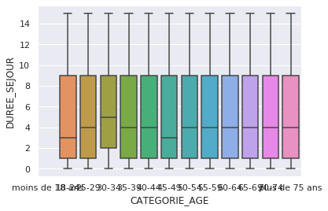


```python
vqList=['SEXE','CATEGORIE_IMC_ADULTE']
for i in vqList:
        col = ["CATEGORIE_AGE",i]
        print(col)
        table_khi2 = data_ASAsup[col]
        tab_cont = table_khi2.pivot_table(index = 'CATEGORIE_AGE', columns = i ,aggfunc =len)
        print('\n\n\n ASA3-4-5 category \n\n\n Contigency table : \n\n',tab_cont)
        pandas2ri.activate()
        with localconverter(ro.default_converter + pandas2ri.converter):
          res_chi2 = stats.chisq_test(tab_cont)
        print(res_chi2)
        pandas2ri.deactivate()
```

    ['CATEGORIE_AGE', 'SEXE']
    
    
    
     ASA3-4-5 category 
    
    
     Contigency table : 
    
     SEXE               F     M
    CATEGORIE_AGE             
    18-24            114   121
    25-29            192   178
    30-34            254   204
    35-39            275   269
    40-44            367   512
    45-49            546   840
    50-54            745  1386
    55-59           1072  2526
    60-64           1438  3411
    65-69           1594  3839
    70-74           1363  2770
    plus de 75 ans  4247  5267
    
    	Pearson's Chi-squared test
    
    data:  structure(list(F = c(114L, 192L, 254L, 275L, 367L, 546L, 745L, 1072L, 1438L, 1594L, 1363L, 4247L), M = c(121L, 178L, 204L, 269L, 512L, 840L, 1386L, 2526L, 3411L, 3839L, 2770L, 5267L)), class = "data.frame", row.names = c("18-24", "25-29", "30-34", "35-39", "40-44", "45-49", "50-54", "55-59", "60-64", "65-69", "70-74", "plus de 75 ans"))
    X-squared = 770.25, df = 11, p-value < 2.2e-16
    
    
    ['CATEGORIE_AGE', 'CATEGORIE_IMC_ADULTE']
    
    
    
     ASA3-4-5 category 
    
    
     Contigency table : 
    
     CATEGORIE_IMC_ADULTE   0  [15-18.5[  [18.5-25[  [25-30[  [30-35[  [35-40[
    CATEGORIE_AGE                                                            
    18-24                  6         44        126       36       17        6
    25-29                  6         61        169       73       36       25
    30-34                  7         40        222      105       51       33
    35-39                  8         33        247      124       85       47
    40-44                 11         61        351      247      140       69
    45-49                  9         99        532      392      246      108
    50-54                 12        153        802      624      370      170
    55-59                 22        197       1241     1114      728      296
    60-64                 14        178       1493     1681     1085      398
    65-69                  9        149       1593     1918     1267      497
    70-74                  7        112       1192     1562      928      332
    plus de 75 ans        12        328       3446     3578     1659      491
    
    	Pearson's Chi-squared test
    
    data:  structure(list(X0 = c(6L, 6L, 7L, 8L, 11L, 9L, 12L, 22L, 14L, 9L, 7L, 12L), X.15.18.5. = c(44L, 61L, 40L, 33L, 61L, 99L, 153L, 197L, 178L, 149L, 112L, 328L), X.18.5.25. = c(126L, 169L, 222L, 247L, 351L, 532L, 802L, 1241L, 1493L, 1593L, 1192L, 3446L), X.25.30. = c(36L, 73L, 105L, 124L, 247L, 392L, 624L, 1114L, 1681L, 1918L, 1562L, 3578L), X.30.35. = c(17L, 36L, 51L, 85L, 140L, 246L, 370L, 728L, 1085L, 1267L, 928L, 1659L), X.35.40. = c(6L, 25L, 33L, 47L, 69L, 108L, 170L, 296L, 398L, 497L, 332L, 491L)), class = "data.frame", row.names = c("18-24", "25-29", "30-34", "35-39", "40-44", "45-49", "50-54", "55-59", "60-64", "65-69", "70-74", "plus de 75 ans"))
    X-squared = 1240.7, df = 55, p-value < 2.2e-16
    
    


```python
vqList=['CATEGORIE_AGE','CATEGORIE_IMC_ADULTE']
for i in vqList:
        col = ["SEXE",i]
        print(col)
        table_khi2 = data_ASAsup[col]
        tab_cont = table_khi2.pivot_table(index = 'SEXE', columns = i ,aggfunc =len)
        print('\n\n\n ASA3-4-5 Category \n\n\n Contigency table : \n\n',tab_cont)
        pandas2ri.activate()
        with localconverter(ro.default_converter + pandas2ri.converter):
          res_chi2 = stats.chisq_test(tab_cont)
        print(res_chi2)
        pandas2ri.deactivate()
```

    ['SEXE', 'CATEGORIE_AGE']
    
    
    
     ASA3-4-5 Category 
    
    
     Contigency table : 
    
     CATEGORIE_AGE  18-24  25-29  30-34  35-39  40-44  45-49  50-54  55-59  60-64  \
    SEXE                                                                           
    F                114    192    254    275    367    546    745   1072   1438   
    M                121    178    204    269    512    840   1386   2526   3411   
    
    CATEGORIE_AGE  65-69  70-74  plus de 75 ans  
    SEXE                                         
    F               1594   1363            4247  
    M               3839   2770            5267  
    
    	Pearson's Chi-squared test
    
    data:  structure(list(X18.24 = c(114L, 121L), X25.29 = c(192L, 178L),     X30.34 = c(254L, 204L), X35.39 = c(275L, 269L), X40.44 = c(367L,     512L), X45.49 = c(546L, 840L), X50.54 = c(745L, 1386L), X55.59 = c(1072L,     2526L), X60.64 = c(1438L, 3411L), X65.69 = c(1594L, 3839L    ), X70.74 = c(1363L, 2770L), plus.de.75.ans = c(4247L, 5267L    )), class = "data.frame", row.names = c("F", "M"))
    X-squared = 770.25, df = 11, p-value < 2.2e-16
    
    
    ['SEXE', 'CATEGORIE_IMC_ADULTE']
    
    
    
     ASA3-4-5 Category 
    
    
     Contigency table : 
    
     CATEGORIE_IMC_ADULTE   0  [15-18.5[  [18.5-25[  [25-30[  [30-35[  [35-40[
    SEXE                                                                     
    F                     56        667       4210     3492     2396     1386
    M                     67        788       7204     7962     4216     1086
    
    	Pearson's Chi-squared test
    
    data:  structure(list(X0 = c(56L, 67L), X.15.18.5. = c(667L, 788L),     X.18.5.25. = c(4210L, 7204L), X.25.30. = c(3492L, 7962L),     X.30.35. = c(2396L, 4216L), X.35.40. = c(1386L, 1086L)), class = "data.frame", row.names = c("F", "M"))
    X-squared = 647.68, df = 5, p-value < 2.2e-16
    
    


```python
vqList=['CATEGORIE_AGE','SEXE']
for i in vqList:
        col = ['CATEGORIE_IMC_ADULTE',i]
        table_khi2 = data_ASAsup[col]
        print(table_khi2)
        tab_cont = table_khi2.pivot_table(index = 'CATEGORIE_IMC_ADULTE', columns = i ,aggfunc =len)
        print('\n\n\n ASA3-4-5 category \n\n\n Contigency table : \n\n',tab_cont)
        pandas2ri.activate()
        with localconverter(ro.default_converter + pandas2ri.converter):
          res_chi2 = stats.chisq_test(tab_cont)
        print(res_chi2)
        pandas2ri.deactivate()
```

           CATEGORIE_IMC_ADULTE   CATEGORIE_AGE
    199372              [25-30[           65-69
    197554              [30-35[           60-64
    123982              [30-35[  plus de 75 ans
    171857            [18.5-25[           50-54
    130223            [18.5-25[           50-54
    ...                     ...             ...
    73638             [18.5-25[  plus de 75 ans
    144696            [18.5-25[           65-69
    164821            [18.5-25[  plus de 75 ans
    252989              [30-35[           60-64
    147923            [18.5-25[  plus de 75 ans
    
    [33530 rows x 2 columns]
    
    
    
     ASA3-4-5 category 
    
    
     Contigency table : 
    
     CATEGORIE_AGE         18-24  25-29  30-34  35-39  40-44  45-49  50-54  55-59  \
    CATEGORIE_IMC_ADULTE                                                           
    0                         6      6      7      8     11      9     12     22   
    [15-18.5[                44     61     40     33     61     99    153    197   
    [18.5-25[               126    169    222    247    351    532    802   1241   
    [25-30[                  36     73    105    124    247    392    624   1114   
    [30-35[                  17     36     51     85    140    246    370    728   
    [35-40[                   6     25     33     47     69    108    170    296   
    
    CATEGORIE_AGE         60-64  65-69  70-74  plus de 75 ans  
    CATEGORIE_IMC_ADULTE                                       
    0                        14      9      7              12  
    [15-18.5[               178    149    112             328  
    [18.5-25[              1493   1593   1192            3446  
    [25-30[                1681   1918   1562            3578  
    [30-35[                1085   1267    928            1659  
    [35-40[                 398    497    332             491  
    
    	Pearson's Chi-squared test
    
    data:  structure(list(X18.24 = c(6L, 44L, 126L, 36L, 17L, 6L), X25.29 = c(6L, 61L, 169L, 73L, 36L, 25L), X30.34 = c(7L, 40L, 222L, 105L, 51L, 33L), X35.39 = c(8L, 33L, 247L, 124L, 85L, 47L), X40.44 = c(11L, 61L, 351L, 247L, 140L, 69L), X45.49 = c(9L, 99L, 532L, 392L, 246L, 108L), X50.54 = c(12L, 153L, 802L, 624L, 370L, 170L), X55.59 = c(22L, 197L, 1241L, 1114L, 728L, 296L), X60.64 = c(14L, 178L, 1493L, 1681L, 1085L, 398L), X65.69 = c(9L, 149L, 1593L, 1918L, 1267L, 497L), X70.74 = c(7L, 112L, 1192L, 1562L, 928L, 332L), plus.de.75.ans = c(12L, 328L, 3446L, 3578L, 1659L, 491L)), class = "data.frame", row.names = c("0", "[15-18.5[", "[18.5-25[", "[25-30[", "[30-35[", "[35-40["))
    X-squared = 1240.7, df = 55, p-value < 2.2e-16
    
    
           CATEGORIE_IMC_ADULTE SEXE
    199372              [25-30[    M
    197554              [30-35[    F
    123982              [30-35[    M
    171857            [18.5-25[    M
    130223            [18.5-25[    F
    ...                     ...  ...
    73638             [18.5-25[    M
    144696            [18.5-25[    F
    164821            [18.5-25[    F
    252989              [30-35[    M
    147923            [18.5-25[    M
    
    [33530 rows x 2 columns]
    
    
    
     ASA3-4-5 category 
    
    
     Contigency table : 
    
     SEXE                     F     M
    CATEGORIE_IMC_ADULTE            
    0                       56    67
    [15-18.5[              667   788
    [18.5-25[             4210  7204
    [25-30[               3492  7962
    [30-35[               2396  4216
    [35-40[               1386  1086
    
    	Pearson's Chi-squared test
    
    data:  structure(list(F = c(56L, 667L, 4210L, 3492L, 2396L, 1386L),     M = c(67L, 788L, 7204L, 7962L, 4216L, 1086L)), class = "data.frame", row.names = c("0", "[15-18.5[", "[18.5-25[", "[25-30[", "[30-35[", "[35-40["))
    X-squared = 647.68, df = 5, p-value < 2.2e-16
    
    


###### Wilcoxon test for mean comparison based on sex within ASA 3-4-5 group


```python
data_M = data_ASAsup.loc[data_select['SEXE'] == 'M']
print(data_M.shape) # Vérification du nombre correct de ligne
print(data_M.columns)

data_F = data_ASAsup.loc[data_select['SEXE'] == 'F']
print(data_F.shape) # Vérification du nombre correct de ligne
print(data_F.columns)

with localconverter(ro.default_converter + pandas2ri.converter):
    modele = stats.wilcox_test(data_M["DUREE_SEJOUR"],data_F["DUREE_SEJOUR"])
print(res_chi2)
pandas2ri.deactivate()

print(data_M.DUREE_SEJOUR.mean())
print(data_F.DUREE_SEJOUR.mean())
```

    (21323, 11)
    Index(['AGE', 'POIDS', 'TAILLE', 'IMC', 'CATEGORIE_IMC_ADULTE', 'ASA',
           'CATEGORIE_ASA', 'SEXE', 'SERVICE', 'DUREE_SEJOUR', 'CATEGORIE_AGE'],
          dtype='object')
    (12207, 11)
    Index(['AGE', 'POIDS', 'TAILLE', 'IMC', 'CATEGORIE_IMC_ADULTE', 'ASA',
           'CATEGORIE_ASA', 'SEXE', 'SERVICE', 'DUREE_SEJOUR', 'CATEGORIE_AGE'],
          dtype='object')
    
    	Pearson's Chi-squared test
    
    data:  structure(list(F = c(56L, 667L, 4210L, 3492L, 2396L, 1386L),     M = c(67L, 788L, 7204L, 7962L, 4216L, 1086L)), class = "data.frame", row.names = c("0", "[15-18.5[", "[18.5-25[", "[25-30[", "[30-35[", "[35-40["))
    X-squared = 647.68, df = 5, p-value < 2.2e-16
    
    
    5.405665244102612
    4.839845990005735


##### Khi-2 test on ASA 1-2 category


```python
vqList=['SEXE','CATEGORIE_IMC_ADULTE']
for i in vqList:
        col = ["CATEGORIE_AGE",i]
        print(col)
        table_khi2 = data_ASAinf[col]
        tab_cont = table_khi2.pivot_table(index = 'CATEGORIE_AGE', columns = i ,aggfunc =len)
        print('\n\n\n Catégorie ASA 1 et 2 \n\n\n Contigency table : \n\n',tab_cont)
        pandas2ri.activate()
        with localconverter(ro.default_converter + pandas2ri.converter):
          res_chi2 = stats.chisq_test(tab_cont)
        print(res_chi2)
        pandas2ri.deactivate()
```

    ['CATEGORIE_AGE', 'SEXE']
    
    
    
     Catégorie ASA 1 et 2 
    
    
     Contigency table : 
    
     SEXE                F     M
    CATEGORIE_AGE              
    18-24            6466  3065
    25-29           12567  3432
    30-34           14514  3658
    35-39            9943  3541
    40-44            6762  4081
    45-49            5916  4410
    50-54            6237  5125
    55-59            5840  5842
    60-64            5680  5662
    65-69            5104  5332
    70-74            3287  3054
    plus de 75 ans   5229  3610
    
    	Pearson's Chi-squared test
    
    data:  structure(list(F = c(6466L, 12567L, 14514L, 9943L, 6762L, 5916L, 6237L, 5840L, 5680L, 5104L, 3287L, 5229L), M = c(3065L, 3432L, 3658L, 3541L, 4081L, 4410L, 5125L, 5842L, 5662L, 5332L, 3054L, 3610L)), class = "data.frame", row.names = c("18-24", "25-29", "30-34", "35-39", "40-44", "45-49", "50-54", "55-59", "60-64", "65-69", "70-74", "plus de 75 ans"))
    X-squared = 8072.5, df = 11, p-value < 2.2e-16
    
    
    ['CATEGORIE_AGE', 'CATEGORIE_IMC_ADULTE']
    
    
    
     Catégorie ASA 1 et 2 
    
    
     Contigency table : 
    
     CATEGORIE_IMC_ADULTE   0  [15-18.5[  [18.5-25[  [25-30[  [30-35[  [35-40[
    CATEGORIE_AGE                                                            
    18-24                 21        874       5542     2035      773      286
    25-29                 16        936       8889     3934     1672      552
    30-34                 26        890      10164     4740     1796      556
    35-39                 19        529       6936     3804     1653      543
    40-44                 15        419       5104     3372     1449      484
    45-49                 15        345       4556     3494     1494      422
    50-54                 19        362       4729     3817     1872      563
    55-59                 20        327       4508     4192     2025      610
    60-64                 15        302       4244     4191     1991      599
    65-69                  9        265       3723     4085     1818      536
    70-74                  5        125       2251     2571     1109      280
    plus de 75 ans        12        247       3628     3538     1211      203
    
    	Pearson's Chi-squared test
    
    data:  structure(list(X0 = c(21L, 16L, 26L, 19L, 15L, 15L, 19L, 20L, 15L, 9L, 5L, 12L), X.15.18.5. = c(874L, 936L, 890L, 529L, 419L, 345L, 362L, 327L, 302L, 265L, 125L, 247L), X.18.5.25. = c(5542L, 8889L, 10164L, 6936L, 5104L, 4556L, 4729L, 4508L, 4244L, 3723L, 2251L, 3628L), X.25.30. = c(2035L, 3934L, 4740L, 3804L, 3372L, 3494L, 3817L, 4192L, 4191L, 4085L, 2571L, 3538L), X.30.35. = c(773L, 1672L, 1796L, 1653L, 1449L, 1494L, 1872L, 2025L, 1991L, 1818L, 1109L, 1211L), X.35.40. = c(286L, 552L, 556L, 543L, 484L, 422L, 563L, 610L, 599L, 536L, 280L, 203L)), class = "data.frame", row.names = c("18-24", "25-29", "30-34", "35-39", "40-44", "45-49", "50-54", "55-59", "60-64", "65-69", "70-74", "plus de 75 ans"))
    X-squared = 5840, df = 55, p-value < 2.2e-16
    
    


```python
vqList=['CATEGORIE_AGE','CATEGORIE_IMC_ADULTE']
for i in vqList:
        col = ["SEXE",i]
        print(col)
        table_khi2 = data_ASAinf[col]
        tab_cont = table_khi2.pivot_table(index = 'SEXE', columns = i ,aggfunc =len)
        print('\n\n\n Catégorie ASA 1 et 2 \n\n\n Contigency table : \n\n',tab_cont)
        pandas2ri.activate()
        with localconverter(ro.default_converter + pandas2ri.converter):
          res_chi2 = stats.chisq_test(tab_cont)
        print(res_chi2)
        pandas2ri.deactivate()
```

    ['SEXE', 'CATEGORIE_AGE']
    
    
    
     Catégorie ASA 1 et 2 
    
    
     Contigency table : 
    
     CATEGORIE_AGE  18-24  25-29  30-34  35-39  40-44  45-49  50-54  55-59  60-64  \
    SEXE                                                                           
    F               6466  12567  14514   9943   6762   5916   6237   5840   5680   
    M               3065   3432   3658   3541   4081   4410   5125   5842   5662   
    
    CATEGORIE_AGE  65-69  70-74  plus de 75 ans  
    SEXE                                         
    F               5104   3287            5229  
    M               5332   3054            3610  
    
    	Pearson's Chi-squared test
    
    data:  structure(list(X18.24 = c(6466L, 3065L), X25.29 = c(12567L, 3432L), X30.34 = c(14514L, 3658L), X35.39 = c(9943L, 3541L), X40.44 = c(6762L, 4081L), X45.49 = c(5916L, 4410L), X50.54 = c(6237L, 5125L), X55.59 = c(5840L, 5842L), X60.64 = c(5680L, 5662L), X65.69 = c(5104L, 5332L), X70.74 = c(3287L, 3054L), plus.de.75.ans = c(5229L, 3610L)), class = "data.frame", row.names = c("F", "M"))
    X-squared = 8072.5, df = 11, p-value < 2.2e-16
    
    
    ['SEXE', 'CATEGORIE_IMC_ADULTE']
    
    
    
     Catégorie ASA 1 et 2 
    
    
     Contigency table : 
    
     CATEGORIE_IMC_ADULTE    0  [15-18.5[  [18.5-25[  [25-30[  [30-35[  [35-40[
    SEXE                                                                      
    F                     146       4306      42323    24191    12056     4523
    M                      46       1315      21951    19582     6807     1111
    
    	Pearson's Chi-squared test
    
    data:  structure(list(X0 = c(146L, 46L), X.15.18.5. = c(4306L, 1315L), X.18.5.25. = c(42323L, 21951L), X.25.30. = c(24191L, 19582L), X.30.35. = c(12056L, 6807L), X.35.40. = c(4523L, 1111L)), class = "data.frame", row.names = c("F", "M"))
    X-squared = 2539.5, df = 5, p-value < 2.2e-16
    
    


```python
vqList=['CATEGORIE_AGE','SEXE']
for i in vqList:
        col = ['CATEGORIE_IMC_ADULTE',i]
        table_khi2 = data_ASAinf[col]
        print(table_khi2)
        tab_cont = table_khi2.pivot_table(index = 'CATEGORIE_IMC_ADULTE', columns = i ,aggfunc =len)
        print('\n\n\n Catégorie ASA 1 et 2 \n\n\n Contigency table : \n\n',tab_cont)
        pandas2ri.activate()
        with localconverter(ro.default_converter + pandas2ri.converter):
          res_chi2 = stats.chisq_test(tab_cont)
        print(res_chi2)
        pandas2ri.deactivate()
```

           CATEGORIE_IMC_ADULTE   CATEGORIE_AGE
    0                   [25-30[           55-59
    1                 [18.5-25[  plus de 75 ans
    5                   [25-30[           40-44
    8                 [18.5-25[           70-74
    9                   [30-35[           30-34
    ...                     ...             ...
    299457            [18.5-25[           35-39
    299459            [18.5-25[  plus de 75 ans
    299463            [18.5-25[           25-29
    299464            [18.5-25[           45-49
    299465              [30-35[           35-39
    
    [138357 rows x 2 columns]
    
    
    
     Catégorie ASA 1 et 2 
    
    
     Contigency table : 
    
     CATEGORIE_AGE         18-24  25-29  30-34  35-39  40-44  45-49  50-54  55-59  \
    CATEGORIE_IMC_ADULTE                                                           
    0                        21     16     26     19     15     15     19     20   
    [15-18.5[               874    936    890    529    419    345    362    327   
    [18.5-25[              5542   8889  10164   6936   5104   4556   4729   4508   
    [25-30[                2035   3934   4740   3804   3372   3494   3817   4192   
    [30-35[                 773   1672   1796   1653   1449   1494   1872   2025   
    [35-40[                 286    552    556    543    484    422    563    610   
    
    CATEGORIE_AGE         60-64  65-69  70-74  plus de 75 ans  
    CATEGORIE_IMC_ADULTE                                       
    0                        15      9      5              12  
    [15-18.5[               302    265    125             247  
    [18.5-25[              4244   3723   2251            3628  
    [25-30[                4191   4085   2571            3538  
    [30-35[                1991   1818   1109            1211  
    [35-40[                 599    536    280             203  
    
    	Pearson's Chi-squared test
    
    data:  structure(list(X18.24 = c(21L, 874L, 5542L, 2035L, 773L, 286L), X25.29 = c(16L, 936L, 8889L, 3934L, 1672L, 552L), X30.34 = c(26L, 890L, 10164L, 4740L, 1796L, 556L), X35.39 = c(19L, 529L, 6936L, 3804L, 1653L, 543L), X40.44 = c(15L, 419L, 5104L, 3372L, 1449L, 484L), X45.49 = c(15L, 345L, 4556L, 3494L, 1494L, 422L), X50.54 = c(19L, 362L, 4729L, 3817L, 1872L, 563L), X55.59 = c(20L, 327L, 4508L, 4192L, 2025L, 610L), X60.64 = c(15L, 302L, 4244L, 4191L, 1991L, 599L), X65.69 = c(9L, 265L, 3723L, 4085L, 1818L, 536L), X70.74 = c(5L, 125L, 2251L, 2571L, 1109L, 280L), plus.de.75.ans = c(12L, 247L, 3628L, 3538L, 1211L, 203L)), class = "data.frame", row.names = c("0", "[15-18.5[", "[18.5-25[", "[25-30[", "[30-35[", "[35-40["))
    X-squared = 5840, df = 55, p-value < 2.2e-16
    
    
           CATEGORIE_IMC_ADULTE SEXE
    0                   [25-30[    M
    1                 [18.5-25[    F
    5                   [25-30[    F
    8                 [18.5-25[    M
    9                   [30-35[    F
    ...                     ...  ...
    299457            [18.5-25[    F
    299459            [18.5-25[    M
    299463            [18.5-25[    F
    299464            [18.5-25[    F
    299465              [30-35[    F
    
    [138357 rows x 2 columns]
    
    
    
     Catégorie ASA 1 et 2 
    
    
     Contigency table : 
    
     SEXE                      F      M
    CATEGORIE_IMC_ADULTE              
    0                       146     46
    [15-18.5[              4306   1315
    [18.5-25[             42323  21951
    [25-30[               24191  19582
    [30-35[               12056   6807
    [35-40[                4523   1111
    
    	Pearson's Chi-squared test
    
    data:  structure(list(F = c(146L, 4306L, 42323L, 24191L, 12056L, 4523L), M = c(46L, 1315L, 21951L, 19582L, 6807L, 1111L)), class = "data.frame", row.names = c("0", "[15-18.5[", "[18.5-25[", "[25-30[", "[30-35[", "[35-40["))
    X-squared = 2539.5, df = 5, p-value < 2.2e-16
    
    


###### Wilcoxon test for mean comparison based on sex within ASA 1-2 group


```python
data_M = data_ASAinf.loc[data_select['SEXE'] == 'M']
print(data_M.shape) # Vérification du nombre correct de ligne
print(data_M.columns)

data_F = data_ASAinf.loc[data_select['SEXE'] == 'F']
print(data_F.shape) # Vérification du nombre correct de ligne
print(data_F.columns)

with localconverter(ro.default_converter + pandas2ri.converter):
    modele = stats.wilcox_test(data_M["DUREE_SEJOUR"],data_F["DUREE_SEJOUR"])
print(res_chi2)
pandas2ri.deactivate()

print(data_M.DUREE_SEJOUR.mean())
print(data_F.DUREE_SEJOUR.mean())
```

    (50812, 11)
    Index(['AGE', 'POIDS', 'TAILLE', 'IMC', 'CATEGORIE_IMC_ADULTE', 'ASA',
           'CATEGORIE_ASA', 'SEXE', 'SERVICE', 'DUREE_SEJOUR', 'CATEGORIE_AGE'],
          dtype='object')
    (87545, 11)
    Index(['AGE', 'POIDS', 'TAILLE', 'IMC', 'CATEGORIE_IMC_ADULTE', 'ASA',
           'CATEGORIE_ASA', 'SEXE', 'SERVICE', 'DUREE_SEJOUR', 'CATEGORIE_AGE'],
          dtype='object')
    
    	Pearson's Chi-squared test
    
    data:  structure(list(F = c(146L, 4306L, 42323L, 24191L, 12056L, 4523L), M = c(46L, 1315L, 21951L, 19582L, 6807L, 1111L)), class = "data.frame", row.names = c("0", "[15-18.5[", "[18.5-25[", "[25-30[", "[30-35[", "[35-40["))
    X-squared = 2539.5, df = 5, p-value < 2.2e-16
    
    
    3.12817838305912
    3.088880004569079


### Wilcoxon test for mean comparison 


```python
data_sejour_ASAinf = data_ASAinf.loc[data_select['CATEGORIE_ASA'] == 'ASA1-2']
print(data_sejour_ASAinf.shape) # Vérification du nombre correct de ligne
print(data_sejour_ASAinf.columns)

data_sejour_ASAsup = data_ASAsup.loc[data_select['CATEGORIE_ASA'] == 'ASA3-4-5']
print(data_sejour_ASAsup.shape) # Vérification du nombre correct de ligne
print(data_sejour_ASAsup.columns)

with localconverter(ro.default_converter + pandas2ri.converter):
    modele = stats.wilcox_test(data_sejour_ASAinf["DUREE_SEJOUR"],data_sejour_ASAsup["DUREE_SEJOUR"])
print(res_chi2)
pandas2ri.deactivate()

print(data_sejour_ASAinf.DUREE_SEJOUR.mean())
print(data_sejour_ASAsup.DUREE_SEJOUR.mean())
```

    (138357, 11)
    Index(['AGE', 'POIDS', 'TAILLE', 'IMC', 'CATEGORIE_IMC_ADULTE', 'ASA',
           'CATEGORIE_ASA', 'SEXE', 'SERVICE', 'DUREE_SEJOUR', 'CATEGORIE_AGE'],
          dtype='object')
    (33530, 11)
    Index(['AGE', 'POIDS', 'TAILLE', 'IMC', 'CATEGORIE_IMC_ADULTE', 'ASA',
           'CATEGORIE_ASA', 'SEXE', 'SERVICE', 'DUREE_SEJOUR', 'CATEGORIE_AGE'],
          dtype='object')
    
    	Pearson's Chi-squared test
    
    data:  structure(list(F = c(146L, 4306L, 42323L, 24191L, 12056L, 4523L), M = c(46L, 1315L, 21951L, 19582L, 6807L, 1111L)), class = "data.frame", row.names = c("0", "[15-18.5[", "[18.5-25[", "[25-30[", "[30-35[", "[35-40["))
    X-squared = 2539.5, df = 5, p-value < 2.2e-16
    
    
    3.1033124453406766
    5.199671935580078


```python

```
